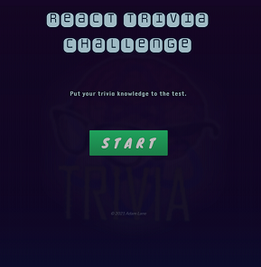

# Open Trivia Challenge

[](/LICENSE)

<b> Website: </b> &nbsp;  https://open-trivia-challenge.herokuapp.com/

## Table of Contents


- [Open Trivia Challenge](#open-trivia-challenge)
  - [Table of Contents](#table-of-contents)
  - [Getting Started ](#getting-started-)
  - [Launch the Application  ](#launch-the-application--)
  - [Website ](#website-)
  - [Technologies Used  ](#technologies-used--)
  - [Contributing ](#contributing-)

---



##  Getting Started <a name = "environment_setup"></a>

To run this application in your own development environment, install [NodeJs](https://nodejs.org/en/about/) and [Git](https://git-scm.com/book/en/v2/Getting-Started-Installing-Git), and a text editor of your choice.


----
## Launch the Application  <a name = "launch"></a>

 Install all node package dependencies listed in the package.json file using the following command in your terminal, in the directory of the project:

```
npm install
```
You can also use:

```
npm i
```
After all packages have been installed, you can run a development version of the application in your web browser on localhost using this command:

```
npm start
```

## Website <a name = "Website"></a>

Deployed to Heroku: &nbsp;
 https://open-trivia-challenge.herokuapp.com/

##  Technologies Used  <a name = "tech_stack"></a>
- [NodeJS](https://nodejs.org/) -  JavaScript runtime
- [ReactJS](https://reactjs.org/) - JavaScript UI library
- [React-Router](https://reactrouter.com/) - Declarative routing for React.js
- [Axios](https://axios-http.com/docs/api_intro) - Promise based HTTP client

----
##  Contributing <a name = "contributing"></a>

Open source contributions are always welcome. Submit a pull request or an issue if you would like to contribute or request improvements.
